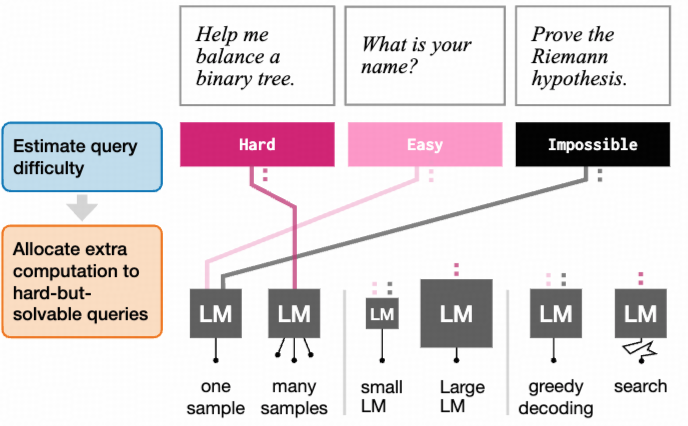

#### [LEARNING HOW HARD TO THINK: INPUT-ADAPTIVE ALLOCATION OF LM COMPUTATION](https://arxiv.org/abs/2410.04707)

来自MIT的Jacob Andreas工作
* 动机: 并不是所有的问题在推理的时候都需要像o1那样分配那么多算力
* 方法: 根据问题的难度, 动态分配算力: 难的问题，用大模型或结合search(CoT/BoN.)做推理, 容易的问题直接回答，或者分配给小模型回答
* 结果: 保证效果最有的前提下，实现50%推理算力成本降低 

<!--  -->

  

