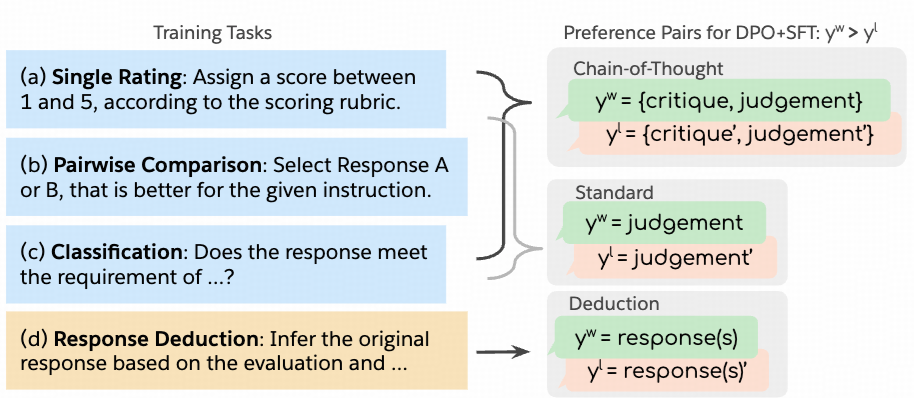

### [Direct Judgement Preference Optimization](https://arxiv.org/abs/2409.14664)

insight: 在不同任务上训练critical model

数据合成:

1. CoT: 对于不同任务(单个评分，pairwise对比，分类)prompt提示让LLM输出CoT的criticas, 基于groud truth标记为correct/chosen，incorrect/rejected
2. 分类: 去除CoT, 保留judegement作为结果
3. reduction: 给定instruction和模型自己的evaluation, 让模型推测原始的response, strong lm的输出作为chosen, weak lm 的输出作为rejected

训练:
* SFT-Judge 基于Llama-3.1-instruct
* 在收集的偏好数训练上训练模型，loss为DPO + SFT loss(类似RPO)

实验结果:

* SFR-Judges outperforms on 10 out of 13 benchmarks. 
* SFR-Judges achieve 44% on Alpaca Eval.
* CoT critical 提升了模型的reasoning能力
* pairwise 平均提升到81% 
* Strong performance on RewardBench: 92.7

